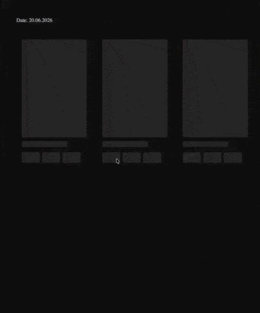
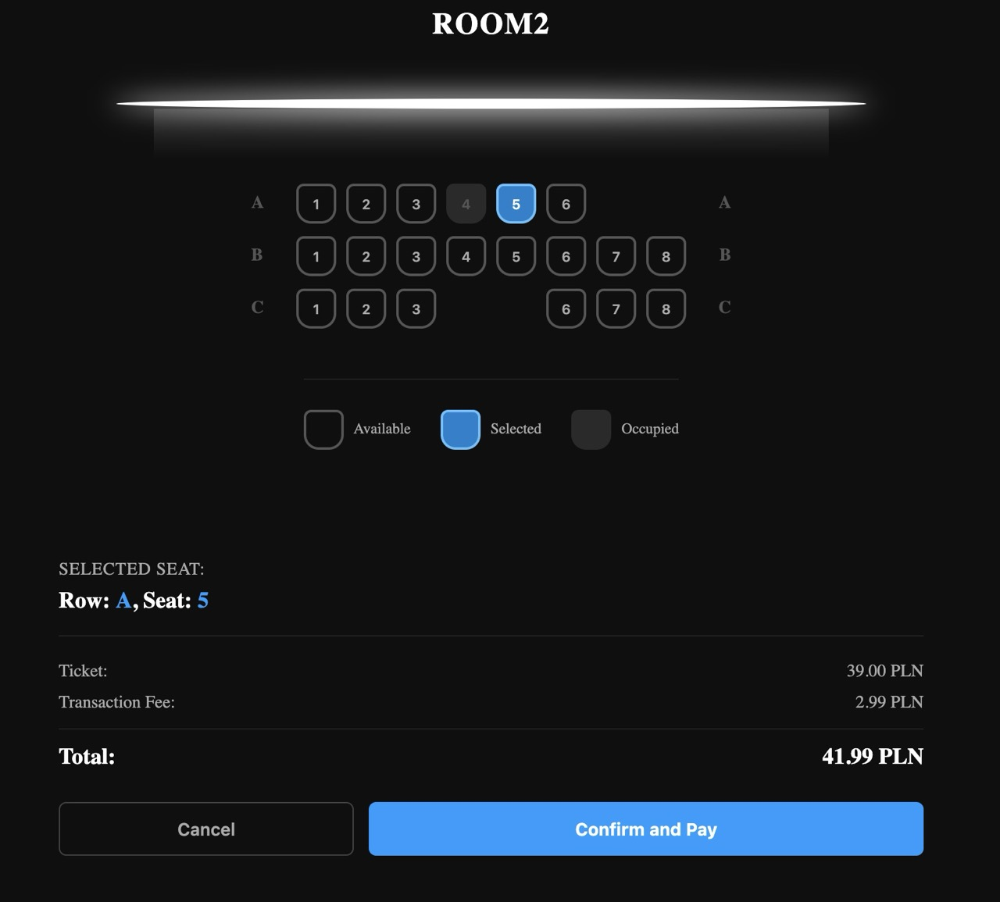

### work in progress

Last update: 21.06.2026

### Cinema booking system design, focusing on real-time seat reservations

React, Typescript, Nodejs, SAM, PostgreSQL (RDS), SQS, S3

### Seat Reservation

TODO: Description

### Requirements / Flow

TODO: Description

___

Well known issues:

- Missing showtime_id validation and no time.date integration (System allowed reservations for invalid or past
  showtime_id values)
- No dynamic prices, fee
- Limiting users to exactly one seat per transaction
- Database overhead via GET Reservations polling: AWS AppSync integration missing
- Hardcoded backend API URL frontend/utils/api.ts
